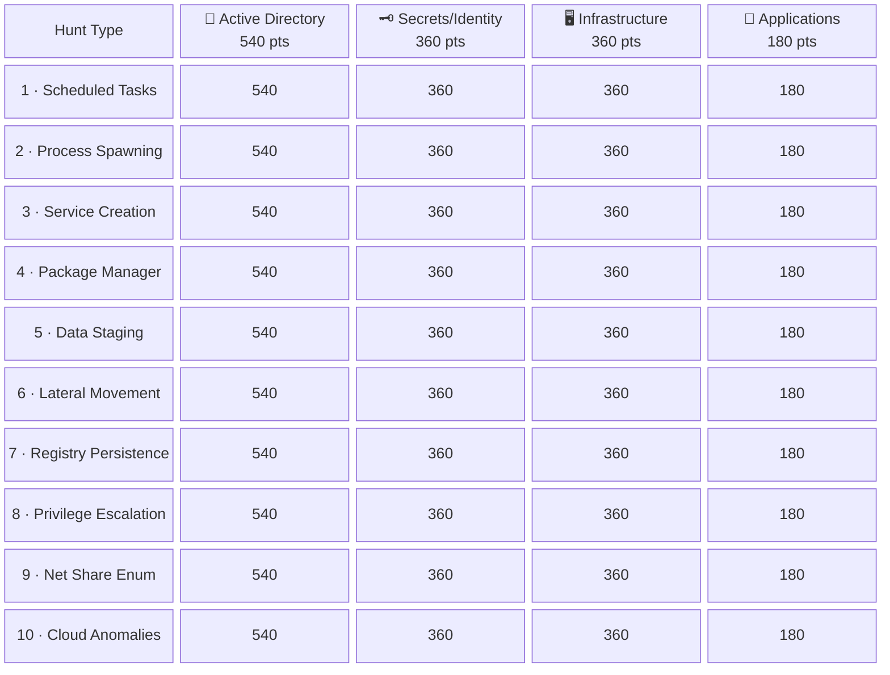

# Hunt Jeopardy — Class 1 | Non-Prod

> Campaign: Class 1 | Environment: NON-PROD | Base Score: 180 pts | Env Multiplier: 1.0×

---

## Scoring Formula

Risk Score = 180 (base) × 1.0 (env) × domain privilege multiplier

| Domain | Privilege Multiplier | Score per Card |
|--------|---------------------|----------------|
| 🔐 Active Directory | 3× | **540 pts** |
| 🗝️ Secrets/Identity | 2× | **360 pts** |
| 🖥️ Infrastructure | 2× | **360 pts** |
| 📱 Applications | 1× | **180 pts** |

**Total Available Points: 14400 pts** (40 cards — trifecta required for each)

---

## Jeopardy Board

---

## Hunt Cards — Deliverables

---

### 1. Scheduled Tasks `T1053`

#### 🔐 Scheduled Tasks × Active Directory [NONPROD]
**Risk Score: 540 pts** | Trifecta Required (CTI + Hunt + Detection)

**CTI Deliverables:**
- [ ] Threat actor playbooks leveraging scheduled tasks
- [ ] MITRE ATT&CK T1053 full technique mapping
- [ ] Baseline scheduled task execution patterns by role/system
- [ ] Anomalous scheduling indicators (off-hours, privileged accounts)
- [ ] Historical APT scheduled task abuse case studies

**Hunt Deliverables:**
- [ ] Approved scheduled task catalog per system/role
- [ ] Task spawn velocity baselines (normal vs. anomalous)
- [ ] Off-hours task execution registry
- [ ] Service account task whitelist
- [ ] Anomaly threshold documentation per domain

**Detection Deliverables:**
- [ ] Task creation and modification detection rules
- [ ] Off-hours and privileged account execution alerts
- [ ] Knowledge base articles for analyst response
- [ ] False positive tuning guide (scheduled backups, maintenance windows)
- [ ] Escalation criteria and runbook

#### 🗝️ Scheduled Tasks × Secrets/Identity [NONPROD]
**Risk Score: 360 pts** | Trifecta Required (CTI + Hunt + Detection)

**CTI Deliverables:**
- [ ] Threat actor playbooks leveraging scheduled tasks
- [ ] MITRE ATT&CK T1053 full technique mapping
- [ ] Baseline scheduled task execution patterns by role/system
- [ ] Anomalous scheduling indicators (off-hours, privileged accounts)
- [ ] Historical APT scheduled task abuse case studies

**Hunt Deliverables:**
- [ ] Approved scheduled task catalog per system/role
- [ ] Task spawn velocity baselines (normal vs. anomalous)
- [ ] Off-hours task execution registry
- [ ] Service account task whitelist
- [ ] Anomaly threshold documentation per domain

**Detection Deliverables:**
- [ ] Task creation and modification detection rules
- [ ] Off-hours and privileged account execution alerts
- [ ] Knowledge base articles for analyst response
- [ ] False positive tuning guide (scheduled backups, maintenance windows)
- [ ] Escalation criteria and runbook

#### 🖥️ Scheduled Tasks × Infrastructure [NONPROD]
**Risk Score: 360 pts** | Trifecta Required (CTI + Hunt + Detection)

**CTI Deliverables:**
- [ ] Threat actor playbooks leveraging scheduled tasks
- [ ] MITRE ATT&CK T1053 full technique mapping
- [ ] Baseline scheduled task execution patterns by role/system
- [ ] Anomalous scheduling indicators (off-hours, privileged accounts)
- [ ] Historical APT scheduled task abuse case studies

**Hunt Deliverables:**
- [ ] Approved scheduled task catalog per system/role
- [ ] Task spawn velocity baselines (normal vs. anomalous)
- [ ] Off-hours task execution registry
- [ ] Service account task whitelist
- [ ] Anomaly threshold documentation per domain

**Detection Deliverables:**
- [ ] Task creation and modification detection rules
- [ ] Off-hours and privileged account execution alerts
- [ ] Knowledge base articles for analyst response
- [ ] False positive tuning guide (scheduled backups, maintenance windows)
- [ ] Escalation criteria and runbook

#### 📱 Scheduled Tasks × Applications [NONPROD]
**Risk Score: 180 pts** | Trifecta Required (CTI + Hunt + Detection)

**CTI Deliverables:**
- [ ] Threat actor playbooks leveraging scheduled tasks
- [ ] MITRE ATT&CK T1053 full technique mapping
- [ ] Baseline scheduled task execution patterns by role/system
- [ ] Anomalous scheduling indicators (off-hours, privileged accounts)
- [ ] Historical APT scheduled task abuse case studies

**Hunt Deliverables:**
- [ ] Approved scheduled task catalog per system/role
- [ ] Task spawn velocity baselines (normal vs. anomalous)
- [ ] Off-hours task execution registry
- [ ] Service account task whitelist
- [ ] Anomaly threshold documentation per domain

**Detection Deliverables:**
- [ ] Task creation and modification detection rules
- [ ] Off-hours and privileged account execution alerts
- [ ] Knowledge base articles for analyst response
- [ ] False positive tuning guide (scheduled backups, maintenance windows)
- [ ] Escalation criteria and runbook

---

### 2. Process Spawning Velocity `T1059`

#### 🔐 Process Spawning Velocity × Active Directory [NONPROD]
**Risk Score: 540 pts** | Trifecta Required (CTI + Hunt + Detection)

**CTI Deliverables:**
- [ ] Process execution chain threat models per adversary group
- [ ] MITRE ATT&CK T1059 full technique mapping
- [ ] Normal process spawn rate baselines per system role
- [ ] LOLBin (Living-off-the-Land Binary) abuse indicators
- [ ] APT process spawning velocity case studies

**Hunt Deliverables:**
- [ ] Parent-child process relationship matrix
- [ ] Spawn rate anomaly registry per endpoint type
- [ ] LOLBin usage catalog (expected vs. anomalous)
- [ ] Unusual interpreter and shell invocation list
- [ ] Credential access chain pattern documentation

**Detection Deliverables:**
- [ ] Process creation and chain detection rules
- [ ] Velocity anomaly and LOLBin execution alerts
- [ ] Knowledge base articles for analyst response
- [ ] Developer and build pipeline FP tuning guide
- [ ] Escalation criteria and runbook

#### 🗝️ Process Spawning Velocity × Secrets/Identity [NONPROD]
**Risk Score: 360 pts** | Trifecta Required (CTI + Hunt + Detection)

**CTI Deliverables:**
- [ ] Process execution chain threat models per adversary group
- [ ] MITRE ATT&CK T1059 full technique mapping
- [ ] Normal process spawn rate baselines per system role
- [ ] LOLBin (Living-off-the-Land Binary) abuse indicators
- [ ] APT process spawning velocity case studies

**Hunt Deliverables:**
- [ ] Parent-child process relationship matrix
- [ ] Spawn rate anomaly registry per endpoint type
- [ ] LOLBin usage catalog (expected vs. anomalous)
- [ ] Unusual interpreter and shell invocation list
- [ ] Credential access chain pattern documentation

**Detection Deliverables:**
- [ ] Process creation and chain detection rules
- [ ] Velocity anomaly and LOLBin execution alerts
- [ ] Knowledge base articles for analyst response
- [ ] Developer and build pipeline FP tuning guide
- [ ] Escalation criteria and runbook

#### 🖥️ Process Spawning Velocity × Infrastructure [NONPROD]
**Risk Score: 360 pts** | Trifecta Required (CTI + Hunt + Detection)

**CTI Deliverables:**
- [ ] Process execution chain threat models per adversary group
- [ ] MITRE ATT&CK T1059 full technique mapping
- [ ] Normal process spawn rate baselines per system role
- [ ] LOLBin (Living-off-the-Land Binary) abuse indicators
- [ ] APT process spawning velocity case studies

**Hunt Deliverables:**
- [ ] Parent-child process relationship matrix
- [ ] Spawn rate anomaly registry per endpoint type
- [ ] LOLBin usage catalog (expected vs. anomalous)
- [ ] Unusual interpreter and shell invocation list
- [ ] Credential access chain pattern documentation

**Detection Deliverables:**
- [ ] Process creation and chain detection rules
- [ ] Velocity anomaly and LOLBin execution alerts
- [ ] Knowledge base articles for analyst response
- [ ] Developer and build pipeline FP tuning guide
- [ ] Escalation criteria and runbook

#### 📱 Process Spawning Velocity × Applications [NONPROD]
**Risk Score: 180 pts** | Trifecta Required (CTI + Hunt + Detection)

**CTI Deliverables:**
- [ ] Process execution chain threat models per adversary group
- [ ] MITRE ATT&CK T1059 full technique mapping
- [ ] Normal process spawn rate baselines per system role
- [ ] LOLBin (Living-off-the-Land Binary) abuse indicators
- [ ] APT process spawning velocity case studies

**Hunt Deliverables:**
- [ ] Parent-child process relationship matrix
- [ ] Spawn rate anomaly registry per endpoint type
- [ ] LOLBin usage catalog (expected vs. anomalous)
- [ ] Unusual interpreter and shell invocation list
- [ ] Credential access chain pattern documentation

**Detection Deliverables:**
- [ ] Process creation and chain detection rules
- [ ] Velocity anomaly and LOLBin execution alerts
- [ ] Knowledge base articles for analyst response
- [ ] Developer and build pipeline FP tuning guide
- [ ] Escalation criteria and runbook

---

### 3. Service/Daemon Creation `T1543`

#### 🔐 Service/Daemon Creation × Active Directory [NONPROD]
**Risk Score: 540 pts** | Trifecta Required (CTI + Hunt + Detection)

**CTI Deliverables:**
- [ ] Service-based backdoor and persistence playbooks
- [ ] MITRE ATT&CK T1543 full technique mapping
- [ ] Baseline approved service/daemon catalog
- [ ] Malicious service binary path and naming patterns
- [ ] APT service persistence case studies

**Hunt Deliverables:**
- [ ] Service binary integrity and hash registry
- [ ] New service creation log with deviation tracking
- [ ] Unsigned or untrusted service catalog
- [ ] Service account privilege anomaly registry
- [ ] Startup configuration change log

**Detection Deliverables:**
- [ ] Service installation and modification detection rules
- [ ] Unsigned binary and suspicious path alerts
- [ ] Knowledge base articles for analyst response
- [ ] Legitimate software deployment FP tuning guide
- [ ] Escalation criteria and runbook

#### 🗝️ Service/Daemon Creation × Secrets/Identity [NONPROD]
**Risk Score: 360 pts** | Trifecta Required (CTI + Hunt + Detection)

**CTI Deliverables:**
- [ ] Service-based backdoor and persistence playbooks
- [ ] MITRE ATT&CK T1543 full technique mapping
- [ ] Baseline approved service/daemon catalog
- [ ] Malicious service binary path and naming patterns
- [ ] APT service persistence case studies

**Hunt Deliverables:**
- [ ] Service binary integrity and hash registry
- [ ] New service creation log with deviation tracking
- [ ] Unsigned or untrusted service catalog
- [ ] Service account privilege anomaly registry
- [ ] Startup configuration change log

**Detection Deliverables:**
- [ ] Service installation and modification detection rules
- [ ] Unsigned binary and suspicious path alerts
- [ ] Knowledge base articles for analyst response
- [ ] Legitimate software deployment FP tuning guide
- [ ] Escalation criteria and runbook

#### 🖥️ Service/Daemon Creation × Infrastructure [NONPROD]
**Risk Score: 360 pts** | Trifecta Required (CTI + Hunt + Detection)

**CTI Deliverables:**
- [ ] Service-based backdoor and persistence playbooks
- [ ] MITRE ATT&CK T1543 full technique mapping
- [ ] Baseline approved service/daemon catalog
- [ ] Malicious service binary path and naming patterns
- [ ] APT service persistence case studies

**Hunt Deliverables:**
- [ ] Service binary integrity and hash registry
- [ ] New service creation log with deviation tracking
- [ ] Unsigned or untrusted service catalog
- [ ] Service account privilege anomaly registry
- [ ] Startup configuration change log

**Detection Deliverables:**
- [ ] Service installation and modification detection rules
- [ ] Unsigned binary and suspicious path alerts
- [ ] Knowledge base articles for analyst response
- [ ] Legitimate software deployment FP tuning guide
- [ ] Escalation criteria and runbook

#### 📱 Service/Daemon Creation × Applications [NONPROD]
**Risk Score: 180 pts** | Trifecta Required (CTI + Hunt + Detection)

**CTI Deliverables:**
- [ ] Service-based backdoor and persistence playbooks
- [ ] MITRE ATT&CK T1543 full technique mapping
- [ ] Baseline approved service/daemon catalog
- [ ] Malicious service binary path and naming patterns
- [ ] APT service persistence case studies

**Hunt Deliverables:**
- [ ] Service binary integrity and hash registry
- [ ] New service creation log with deviation tracking
- [ ] Unsigned or untrusted service catalog
- [ ] Service account privilege anomaly registry
- [ ] Startup configuration change log

**Detection Deliverables:**
- [ ] Service installation and modification detection rules
- [ ] Unsigned binary and suspicious path alerts
- [ ] Knowledge base articles for analyst response
- [ ] Legitimate software deployment FP tuning guide
- [ ] Escalation criteria and runbook

---

### 4. Package Manager Activity `T1195`

#### 🔐 Package Manager Activity × Active Directory [NONPROD]
**Risk Score: 540 pts** | Trifecta Required (CTI + Hunt + Detection)

**CTI Deliverables:**
- [ ] Supply chain attack and package poisoning playbooks
- [ ] MITRE ATT&CK T1195 full technique mapping
- [ ] Approved package and repository baseline
- [ ] Malicious package indicators and known bad hashes
- [ ] Recent supply chain incident case studies (SolarWinds, XZ Utils, etc.)

**Hunt Deliverables:**
- [ ] Unauthorized repository access log
- [ ] Package hash and integrity registry
- [ ] Dependency confusion and typosquatting indicator list
- [ ] Build system and CI/CD anomaly catalog
- [ ] Developer tool misuse pattern documentation

**Detection Deliverables:**
- [ ] Unauthorized package install detection rules
- [ ] Hash mismatch and unknown source alerts
- [ ] Knowledge base articles for analyst response
- [ ] Approved CI/CD pipeline FP tuning guide
- [ ] Escalation criteria and runbook

#### 🗝️ Package Manager Activity × Secrets/Identity [NONPROD]
**Risk Score: 360 pts** | Trifecta Required (CTI + Hunt + Detection)

**CTI Deliverables:**
- [ ] Supply chain attack and package poisoning playbooks
- [ ] MITRE ATT&CK T1195 full technique mapping
- [ ] Approved package and repository baseline
- [ ] Malicious package indicators and known bad hashes
- [ ] Recent supply chain incident case studies (SolarWinds, XZ Utils, etc.)

**Hunt Deliverables:**
- [ ] Unauthorized repository access log
- [ ] Package hash and integrity registry
- [ ] Dependency confusion and typosquatting indicator list
- [ ] Build system and CI/CD anomaly catalog
- [ ] Developer tool misuse pattern documentation

**Detection Deliverables:**
- [ ] Unauthorized package install detection rules
- [ ] Hash mismatch and unknown source alerts
- [ ] Knowledge base articles for analyst response
- [ ] Approved CI/CD pipeline FP tuning guide
- [ ] Escalation criteria and runbook

#### 🖥️ Package Manager Activity × Infrastructure [NONPROD]
**Risk Score: 360 pts** | Trifecta Required (CTI + Hunt + Detection)

**CTI Deliverables:**
- [ ] Supply chain attack and package poisoning playbooks
- [ ] MITRE ATT&CK T1195 full technique mapping
- [ ] Approved package and repository baseline
- [ ] Malicious package indicators and known bad hashes
- [ ] Recent supply chain incident case studies (SolarWinds, XZ Utils, etc.)

**Hunt Deliverables:**
- [ ] Unauthorized repository access log
- [ ] Package hash and integrity registry
- [ ] Dependency confusion and typosquatting indicator list
- [ ] Build system and CI/CD anomaly catalog
- [ ] Developer tool misuse pattern documentation

**Detection Deliverables:**
- [ ] Unauthorized package install detection rules
- [ ] Hash mismatch and unknown source alerts
- [ ] Knowledge base articles for analyst response
- [ ] Approved CI/CD pipeline FP tuning guide
- [ ] Escalation criteria and runbook

#### 📱 Package Manager Activity × Applications [NONPROD]
**Risk Score: 180 pts** | Trifecta Required (CTI + Hunt + Detection)

**CTI Deliverables:**
- [ ] Supply chain attack and package poisoning playbooks
- [ ] MITRE ATT&CK T1195 full technique mapping
- [ ] Approved package and repository baseline
- [ ] Malicious package indicators and known bad hashes
- [ ] Recent supply chain incident case studies (SolarWinds, XZ Utils, etc.)

**Hunt Deliverables:**
- [ ] Unauthorized repository access log
- [ ] Package hash and integrity registry
- [ ] Dependency confusion and typosquatting indicator list
- [ ] Build system and CI/CD anomaly catalog
- [ ] Developer tool misuse pattern documentation

**Detection Deliverables:**
- [ ] Unauthorized package install detection rules
- [ ] Hash mismatch and unknown source alerts
- [ ] Knowledge base articles for analyst response
- [ ] Approved CI/CD pipeline FP tuning guide
- [ ] Escalation criteria and runbook

---

### 5. Data Staging `T1074`

#### 🔐 Data Staging × Active Directory [NONPROD]
**Risk Score: 540 pts** | Trifecta Required (CTI + Hunt + Detection)

**CTI Deliverables:**
- [ ] Data exfiltration staging playbooks per threat actor
- [ ] MITRE ATT&CK T1074 full technique mapping
- [ ] Normal data movement and transfer baselines
- [ ] Staging location indicators (temp dirs, cloud buckets, removable media)
- [ ] APT data staging and pre-exfiltration case studies

**Hunt Deliverables:**
- [ ] Large file movement and transfer registry
- [ ] Unusual destination and upload location catalog
- [ ] Compression and archive utility anomaly list
- [ ] Temporary directory usage baseline
- [ ] Cloud upload and external transfer pattern catalog

**Detection Deliverables:**
- [ ] Data staging and bulk transfer detection rules
- [ ] Volume threshold and unusual destination alerts
- [ ] Knowledge base articles for analyst response
- [ ] Authorized backup and sync operation FP tuning guide
- [ ] Escalation criteria and runbook

#### 🗝️ Data Staging × Secrets/Identity [NONPROD]
**Risk Score: 360 pts** | Trifecta Required (CTI + Hunt + Detection)

**CTI Deliverables:**
- [ ] Data exfiltration staging playbooks per threat actor
- [ ] MITRE ATT&CK T1074 full technique mapping
- [ ] Normal data movement and transfer baselines
- [ ] Staging location indicators (temp dirs, cloud buckets, removable media)
- [ ] APT data staging and pre-exfiltration case studies

**Hunt Deliverables:**
- [ ] Large file movement and transfer registry
- [ ] Unusual destination and upload location catalog
- [ ] Compression and archive utility anomaly list
- [ ] Temporary directory usage baseline
- [ ] Cloud upload and external transfer pattern catalog

**Detection Deliverables:**
- [ ] Data staging and bulk transfer detection rules
- [ ] Volume threshold and unusual destination alerts
- [ ] Knowledge base articles for analyst response
- [ ] Authorized backup and sync operation FP tuning guide
- [ ] Escalation criteria and runbook

#### 🖥️ Data Staging × Infrastructure [NONPROD]
**Risk Score: 360 pts** | Trifecta Required (CTI + Hunt + Detection)

**CTI Deliverables:**
- [ ] Data exfiltration staging playbooks per threat actor
- [ ] MITRE ATT&CK T1074 full technique mapping
- [ ] Normal data movement and transfer baselines
- [ ] Staging location indicators (temp dirs, cloud buckets, removable media)
- [ ] APT data staging and pre-exfiltration case studies

**Hunt Deliverables:**
- [ ] Large file movement and transfer registry
- [ ] Unusual destination and upload location catalog
- [ ] Compression and archive utility anomaly list
- [ ] Temporary directory usage baseline
- [ ] Cloud upload and external transfer pattern catalog

**Detection Deliverables:**
- [ ] Data staging and bulk transfer detection rules
- [ ] Volume threshold and unusual destination alerts
- [ ] Knowledge base articles for analyst response
- [ ] Authorized backup and sync operation FP tuning guide
- [ ] Escalation criteria and runbook

#### 📱 Data Staging × Applications [NONPROD]
**Risk Score: 180 pts** | Trifecta Required (CTI + Hunt + Detection)

**CTI Deliverables:**
- [ ] Data exfiltration staging playbooks per threat actor
- [ ] MITRE ATT&CK T1074 full technique mapping
- [ ] Normal data movement and transfer baselines
- [ ] Staging location indicators (temp dirs, cloud buckets, removable media)
- [ ] APT data staging and pre-exfiltration case studies

**Hunt Deliverables:**
- [ ] Large file movement and transfer registry
- [ ] Unusual destination and upload location catalog
- [ ] Compression and archive utility anomaly list
- [ ] Temporary directory usage baseline
- [ ] Cloud upload and external transfer pattern catalog

**Detection Deliverables:**
- [ ] Data staging and bulk transfer detection rules
- [ ] Volume threshold and unusual destination alerts
- [ ] Knowledge base articles for analyst response
- [ ] Authorized backup and sync operation FP tuning guide
- [ ] Escalation criteria and runbook

---

### 6. Lateral Movement `T1021`

#### 🔐 Lateral Movement × Active Directory [NONPROD]
**Risk Score: 540 pts** | Trifecta Required (CTI + Hunt + Detection)

**CTI Deliverables:**
- [ ] Lateral movement technique playbooks per adversary group
- [ ] MITRE ATT&CK T1021 full technique mapping
- [ ] Normal inter-system communication and access baselines
- [ ] Credential reuse and pass-the-hash indicators
- [ ] APT lateral movement chain case studies

**Hunt Deliverables:**
- [ ] Admin share and remote access registry
- [ ] Credential reuse and anomalous authentication pattern catalog
- [ ] Unusual lateral protocol usage list (SMB, WMI, RDP, SSH)
- [ ] Inter-system access anomaly log
- [ ] Pass-the-hash and Kerberoasting indicator list

**Detection Deliverables:**
- [ ] Lateral movement and hop detection rules
- [ ] Anomalous authentication and protocol abuse alerts
- [ ] Knowledge base articles for analyst response
- [ ] Authorized admin and management tool FP tuning guide
- [ ] Escalation criteria and runbook

#### 🗝️ Lateral Movement × Secrets/Identity [NONPROD]
**Risk Score: 360 pts** | Trifecta Required (CTI + Hunt + Detection)

**CTI Deliverables:**
- [ ] Lateral movement technique playbooks per adversary group
- [ ] MITRE ATT&CK T1021 full technique mapping
- [ ] Normal inter-system communication and access baselines
- [ ] Credential reuse and pass-the-hash indicators
- [ ] APT lateral movement chain case studies

**Hunt Deliverables:**
- [ ] Admin share and remote access registry
- [ ] Credential reuse and anomalous authentication pattern catalog
- [ ] Unusual lateral protocol usage list (SMB, WMI, RDP, SSH)
- [ ] Inter-system access anomaly log
- [ ] Pass-the-hash and Kerberoasting indicator list

**Detection Deliverables:**
- [ ] Lateral movement and hop detection rules
- [ ] Anomalous authentication and protocol abuse alerts
- [ ] Knowledge base articles for analyst response
- [ ] Authorized admin and management tool FP tuning guide
- [ ] Escalation criteria and runbook

#### 🖥️ Lateral Movement × Infrastructure [NONPROD]
**Risk Score: 360 pts** | Trifecta Required (CTI + Hunt + Detection)

**CTI Deliverables:**
- [ ] Lateral movement technique playbooks per adversary group
- [ ] MITRE ATT&CK T1021 full technique mapping
- [ ] Normal inter-system communication and access baselines
- [ ] Credential reuse and pass-the-hash indicators
- [ ] APT lateral movement chain case studies

**Hunt Deliverables:**
- [ ] Admin share and remote access registry
- [ ] Credential reuse and anomalous authentication pattern catalog
- [ ] Unusual lateral protocol usage list (SMB, WMI, RDP, SSH)
- [ ] Inter-system access anomaly log
- [ ] Pass-the-hash and Kerberoasting indicator list

**Detection Deliverables:**
- [ ] Lateral movement and hop detection rules
- [ ] Anomalous authentication and protocol abuse alerts
- [ ] Knowledge base articles for analyst response
- [ ] Authorized admin and management tool FP tuning guide
- [ ] Escalation criteria and runbook

#### 📱 Lateral Movement × Applications [NONPROD]
**Risk Score: 180 pts** | Trifecta Required (CTI + Hunt + Detection)

**CTI Deliverables:**
- [ ] Lateral movement technique playbooks per adversary group
- [ ] MITRE ATT&CK T1021 full technique mapping
- [ ] Normal inter-system communication and access baselines
- [ ] Credential reuse and pass-the-hash indicators
- [ ] APT lateral movement chain case studies

**Hunt Deliverables:**
- [ ] Admin share and remote access registry
- [ ] Credential reuse and anomalous authentication pattern catalog
- [ ] Unusual lateral protocol usage list (SMB, WMI, RDP, SSH)
- [ ] Inter-system access anomaly log
- [ ] Pass-the-hash and Kerberoasting indicator list

**Detection Deliverables:**
- [ ] Lateral movement and hop detection rules
- [ ] Anomalous authentication and protocol abuse alerts
- [ ] Knowledge base articles for analyst response
- [ ] Authorized admin and management tool FP tuning guide
- [ ] Escalation criteria and runbook

---

### 7. Registry Persistence `T1547`

#### 🔐 Registry Persistence × Active Directory [NONPROD]
**Risk Score: 540 pts** | Trifecta Required (CTI + Hunt + Detection)

**CTI Deliverables:**
- [ ] Registry-based persistence playbooks per threat actor
- [ ] MITRE ATT&CK T1547 full technique mapping
- [ ] Clean registry baseline (known good state per system role)
- [ ] Persistence key and autorun value indicators
- [ ] APT registry abuse and rootkit case studies

**Hunt Deliverables:**
- [ ] Registry modification catalog with deviation tracking
- [ ] Autorun and persistence key anomaly list
- [ ] COM object hijacking indicator registry
- [ ] DLL search order manipulation pattern log
- [ ] Boot and logon persistence change log

**Detection Deliverables:**
- [ ] Registry modification and persistence key detection rules
- [ ] Autorun and COM hijack alerts
- [ ] Knowledge base articles for analyst response
- [ ] Legitimate software installer registry FP tuning guide
- [ ] Escalation criteria and runbook

#### 🗝️ Registry Persistence × Secrets/Identity [NONPROD]
**Risk Score: 360 pts** | Trifecta Required (CTI + Hunt + Detection)

**CTI Deliverables:**
- [ ] Registry-based persistence playbooks per threat actor
- [ ] MITRE ATT&CK T1547 full technique mapping
- [ ] Clean registry baseline (known good state per system role)
- [ ] Persistence key and autorun value indicators
- [ ] APT registry abuse and rootkit case studies

**Hunt Deliverables:**
- [ ] Registry modification catalog with deviation tracking
- [ ] Autorun and persistence key anomaly list
- [ ] COM object hijacking indicator registry
- [ ] DLL search order manipulation pattern log
- [ ] Boot and logon persistence change log

**Detection Deliverables:**
- [ ] Registry modification and persistence key detection rules
- [ ] Autorun and COM hijack alerts
- [ ] Knowledge base articles for analyst response
- [ ] Legitimate software installer registry FP tuning guide
- [ ] Escalation criteria and runbook

#### 🖥️ Registry Persistence × Infrastructure [NONPROD]
**Risk Score: 360 pts** | Trifecta Required (CTI + Hunt + Detection)

**CTI Deliverables:**
- [ ] Registry-based persistence playbooks per threat actor
- [ ] MITRE ATT&CK T1547 full technique mapping
- [ ] Clean registry baseline (known good state per system role)
- [ ] Persistence key and autorun value indicators
- [ ] APT registry abuse and rootkit case studies

**Hunt Deliverables:**
- [ ] Registry modification catalog with deviation tracking
- [ ] Autorun and persistence key anomaly list
- [ ] COM object hijacking indicator registry
- [ ] DLL search order manipulation pattern log
- [ ] Boot and logon persistence change log

**Detection Deliverables:**
- [ ] Registry modification and persistence key detection rules
- [ ] Autorun and COM hijack alerts
- [ ] Knowledge base articles for analyst response
- [ ] Legitimate software installer registry FP tuning guide
- [ ] Escalation criteria and runbook

#### 📱 Registry Persistence × Applications [NONPROD]
**Risk Score: 180 pts** | Trifecta Required (CTI + Hunt + Detection)

**CTI Deliverables:**
- [ ] Registry-based persistence playbooks per threat actor
- [ ] MITRE ATT&CK T1547 full technique mapping
- [ ] Clean registry baseline (known good state per system role)
- [ ] Persistence key and autorun value indicators
- [ ] APT registry abuse and rootkit case studies

**Hunt Deliverables:**
- [ ] Registry modification catalog with deviation tracking
- [ ] Autorun and persistence key anomaly list
- [ ] COM object hijacking indicator registry
- [ ] DLL search order manipulation pattern log
- [ ] Boot and logon persistence change log

**Detection Deliverables:**
- [ ] Registry modification and persistence key detection rules
- [ ] Autorun and COM hijack alerts
- [ ] Knowledge base articles for analyst response
- [ ] Legitimate software installer registry FP tuning guide
- [ ] Escalation criteria and runbook

---

### 8. Privilege Escalation `T1068`

#### 🔐 Privilege Escalation × Active Directory [NONPROD]
**Risk Score: 540 pts** | Trifecta Required (CTI + Hunt + Detection)

**CTI Deliverables:**
- [ ] Privilege escalation technique playbooks per adversary group
- [ ] MITRE ATT&CK T1068 full technique mapping
- [ ] Normal privilege and token usage baselines per role
- [ ] UAC bypass and kernel exploit indicators
- [ ] APT privilege escalation to domain admin case studies

**Hunt Deliverables:**
- [ ] Token impersonation and privilege use registry
- [ ] UAC bypass technique pattern catalog
- [ ] Kernel exploit attempt indicator list
- [ ] Service account elevation anomaly log
- [ ] Group policy and ACL abuse pattern documentation

**Detection Deliverables:**
- [ ] Privilege escalation and token manipulation detection rules
- [ ] UAC bypass and unexpected elevation alerts
- [ ] Knowledge base articles for analyst response
- [ ] Authorized administrative workflow FP tuning guide
- [ ] Escalation criteria and runbook

#### 🗝️ Privilege Escalation × Secrets/Identity [NONPROD]
**Risk Score: 360 pts** | Trifecta Required (CTI + Hunt + Detection)

**CTI Deliverables:**
- [ ] Privilege escalation technique playbooks per adversary group
- [ ] MITRE ATT&CK T1068 full technique mapping
- [ ] Normal privilege and token usage baselines per role
- [ ] UAC bypass and kernel exploit indicators
- [ ] APT privilege escalation to domain admin case studies

**Hunt Deliverables:**
- [ ] Token impersonation and privilege use registry
- [ ] UAC bypass technique pattern catalog
- [ ] Kernel exploit attempt indicator list
- [ ] Service account elevation anomaly log
- [ ] Group policy and ACL abuse pattern documentation

**Detection Deliverables:**
- [ ] Privilege escalation and token manipulation detection rules
- [ ] UAC bypass and unexpected elevation alerts
- [ ] Knowledge base articles for analyst response
- [ ] Authorized administrative workflow FP tuning guide
- [ ] Escalation criteria and runbook

#### 🖥️ Privilege Escalation × Infrastructure [NONPROD]
**Risk Score: 360 pts** | Trifecta Required (CTI + Hunt + Detection)

**CTI Deliverables:**
- [ ] Privilege escalation technique playbooks per adversary group
- [ ] MITRE ATT&CK T1068 full technique mapping
- [ ] Normal privilege and token usage baselines per role
- [ ] UAC bypass and kernel exploit indicators
- [ ] APT privilege escalation to domain admin case studies

**Hunt Deliverables:**
- [ ] Token impersonation and privilege use registry
- [ ] UAC bypass technique pattern catalog
- [ ] Kernel exploit attempt indicator list
- [ ] Service account elevation anomaly log
- [ ] Group policy and ACL abuse pattern documentation

**Detection Deliverables:**
- [ ] Privilege escalation and token manipulation detection rules
- [ ] UAC bypass and unexpected elevation alerts
- [ ] Knowledge base articles for analyst response
- [ ] Authorized administrative workflow FP tuning guide
- [ ] Escalation criteria and runbook

#### 📱 Privilege Escalation × Applications [NONPROD]
**Risk Score: 180 pts** | Trifecta Required (CTI + Hunt + Detection)

**CTI Deliverables:**
- [ ] Privilege escalation technique playbooks per adversary group
- [ ] MITRE ATT&CK T1068 full technique mapping
- [ ] Normal privilege and token usage baselines per role
- [ ] UAC bypass and kernel exploit indicators
- [ ] APT privilege escalation to domain admin case studies

**Hunt Deliverables:**
- [ ] Token impersonation and privilege use registry
- [ ] UAC bypass technique pattern catalog
- [ ] Kernel exploit attempt indicator list
- [ ] Service account elevation anomaly log
- [ ] Group policy and ACL abuse pattern documentation

**Detection Deliverables:**
- [ ] Privilege escalation and token manipulation detection rules
- [ ] UAC bypass and unexpected elevation alerts
- [ ] Knowledge base articles for analyst response
- [ ] Authorized administrative workflow FP tuning guide
- [ ] Escalation criteria and runbook

---

### 9. Net Share Enum `T1135`

#### 🔐 Net Share Enum × Active Directory [NONPROD]
**Risk Score: 540 pts** | Trifecta Required (CTI + Hunt + Detection)

**CTI Deliverables:**
- [ ] Network share enumeration and recon playbooks
- [ ] MITRE ATT&CK T1135 full technique mapping
- [ ] Normal share access and mount baselines
- [ ] Hidden share and admin share discovery indicators
- [ ] APT network recon and share enumeration case studies

**Hunt Deliverables:**
- [ ] Share access and mount activity registry
- [ ] Admin share catalog with expected access patterns
- [ ] Hidden share discovery and creation log
- [ ] Enumeration tool signature and usage log
- [ ] Mass access and rapid enumeration anomaly catalog

**Detection Deliverables:**
- [ ] Share enumeration and rapid mount detection rules
- [ ] Mass access and hidden share creation alerts
- [ ] Knowledge base articles for analyst response
- [ ] Authorized IT admin enumeration FP tuning guide
- [ ] Escalation criteria and runbook

#### 🗝️ Net Share Enum × Secrets/Identity [NONPROD]
**Risk Score: 360 pts** | Trifecta Required (CTI + Hunt + Detection)

**CTI Deliverables:**
- [ ] Network share enumeration and recon playbooks
- [ ] MITRE ATT&CK T1135 full technique mapping
- [ ] Normal share access and mount baselines
- [ ] Hidden share and admin share discovery indicators
- [ ] APT network recon and share enumeration case studies

**Hunt Deliverables:**
- [ ] Share access and mount activity registry
- [ ] Admin share catalog with expected access patterns
- [ ] Hidden share discovery and creation log
- [ ] Enumeration tool signature and usage log
- [ ] Mass access and rapid enumeration anomaly catalog

**Detection Deliverables:**
- [ ] Share enumeration and rapid mount detection rules
- [ ] Mass access and hidden share creation alerts
- [ ] Knowledge base articles for analyst response
- [ ] Authorized IT admin enumeration FP tuning guide
- [ ] Escalation criteria and runbook

#### 🖥️ Net Share Enum × Infrastructure [NONPROD]
**Risk Score: 360 pts** | Trifecta Required (CTI + Hunt + Detection)

**CTI Deliverables:**
- [ ] Network share enumeration and recon playbooks
- [ ] MITRE ATT&CK T1135 full technique mapping
- [ ] Normal share access and mount baselines
- [ ] Hidden share and admin share discovery indicators
- [ ] APT network recon and share enumeration case studies

**Hunt Deliverables:**
- [ ] Share access and mount activity registry
- [ ] Admin share catalog with expected access patterns
- [ ] Hidden share discovery and creation log
- [ ] Enumeration tool signature and usage log
- [ ] Mass access and rapid enumeration anomaly catalog

**Detection Deliverables:**
- [ ] Share enumeration and rapid mount detection rules
- [ ] Mass access and hidden share creation alerts
- [ ] Knowledge base articles for analyst response
- [ ] Authorized IT admin enumeration FP tuning guide
- [ ] Escalation criteria and runbook

#### 📱 Net Share Enum × Applications [NONPROD]
**Risk Score: 180 pts** | Trifecta Required (CTI + Hunt + Detection)

**CTI Deliverables:**
- [ ] Network share enumeration and recon playbooks
- [ ] MITRE ATT&CK T1135 full technique mapping
- [ ] Normal share access and mount baselines
- [ ] Hidden share and admin share discovery indicators
- [ ] APT network recon and share enumeration case studies

**Hunt Deliverables:**
- [ ] Share access and mount activity registry
- [ ] Admin share catalog with expected access patterns
- [ ] Hidden share discovery and creation log
- [ ] Enumeration tool signature and usage log
- [ ] Mass access and rapid enumeration anomaly catalog

**Detection Deliverables:**
- [ ] Share enumeration and rapid mount detection rules
- [ ] Mass access and hidden share creation alerts
- [ ] Knowledge base articles for analyst response
- [ ] Authorized IT admin enumeration FP tuning guide
- [ ] Escalation criteria and runbook

---

### 10. Cloud Anomalies `T1578`

#### 🔐 Cloud Anomalies × Active Directory [NONPROD]
**Risk Score: 540 pts** | Trifecta Required (CTI + Hunt + Detection)

**CTI Deliverables:**
- [ ] Cloud-based attack and resource abuse playbooks
- [ ] MITRE ATT&CK T1578 full technique mapping
- [ ] Normal cloud API call and resource provisioning baselines
- [ ] Cross-account access and privilege escalation indicators
- [ ] Cloud APT and cryptojacking case studies

**Hunt Deliverables:**
- [ ] API call anomaly registry per service and account
- [ ] Unexpected resource creation and modification catalog
- [ ] Cross-account access pattern list
- [ ] IAM policy and permission change log
- [ ] Cost anomaly and resource hoarding indicator catalog

**Detection Deliverables:**
- [ ] Cloud anomaly and unauthorized resource creation rules
- [ ] API abuse and cross-account access alerts
- [ ] Knowledge base articles for analyst response
- [ ] DevOps and automation pipeline FP tuning guide
- [ ] Escalation criteria and runbook

#### 🗝️ Cloud Anomalies × Secrets/Identity [NONPROD]
**Risk Score: 360 pts** | Trifecta Required (CTI + Hunt + Detection)

**CTI Deliverables:**
- [ ] Cloud-based attack and resource abuse playbooks
- [ ] MITRE ATT&CK T1578 full technique mapping
- [ ] Normal cloud API call and resource provisioning baselines
- [ ] Cross-account access and privilege escalation indicators
- [ ] Cloud APT and cryptojacking case studies

**Hunt Deliverables:**
- [ ] API call anomaly registry per service and account
- [ ] Unexpected resource creation and modification catalog
- [ ] Cross-account access pattern list
- [ ] IAM policy and permission change log
- [ ] Cost anomaly and resource hoarding indicator catalog

**Detection Deliverables:**
- [ ] Cloud anomaly and unauthorized resource creation rules
- [ ] API abuse and cross-account access alerts
- [ ] Knowledge base articles for analyst response
- [ ] DevOps and automation pipeline FP tuning guide
- [ ] Escalation criteria and runbook

#### 🖥️ Cloud Anomalies × Infrastructure [NONPROD]
**Risk Score: 360 pts** | Trifecta Required (CTI + Hunt + Detection)

**CTI Deliverables:**
- [ ] Cloud-based attack and resource abuse playbooks
- [ ] MITRE ATT&CK T1578 full technique mapping
- [ ] Normal cloud API call and resource provisioning baselines
- [ ] Cross-account access and privilege escalation indicators
- [ ] Cloud APT and cryptojacking case studies

**Hunt Deliverables:**
- [ ] API call anomaly registry per service and account
- [ ] Unexpected resource creation and modification catalog
- [ ] Cross-account access pattern list
- [ ] IAM policy and permission change log
- [ ] Cost anomaly and resource hoarding indicator catalog

**Detection Deliverables:**
- [ ] Cloud anomaly and unauthorized resource creation rules
- [ ] API abuse and cross-account access alerts
- [ ] Knowledge base articles for analyst response
- [ ] DevOps and automation pipeline FP tuning guide
- [ ] Escalation criteria and runbook

#### 📱 Cloud Anomalies × Applications [NONPROD]
**Risk Score: 180 pts** | Trifecta Required (CTI + Hunt + Detection)

**CTI Deliverables:**
- [ ] Cloud-based attack and resource abuse playbooks
- [ ] MITRE ATT&CK T1578 full technique mapping
- [ ] Normal cloud API call and resource provisioning baselines
- [ ] Cross-account access and privilege escalation indicators
- [ ] Cloud APT and cryptojacking case studies

**Hunt Deliverables:**
- [ ] API call anomaly registry per service and account
- [ ] Unexpected resource creation and modification catalog
- [ ] Cross-account access pattern list
- [ ] IAM policy and permission change log
- [ ] Cost anomaly and resource hoarding indicator catalog

**Detection Deliverables:**
- [ ] Cloud anomaly and unauthorized resource creation rules
- [ ] API abuse and cross-account access alerts
- [ ] Knowledge base articles for analyst response
- [ ] DevOps and automation pipeline FP tuning guide
- [ ] Escalation criteria and runbook
