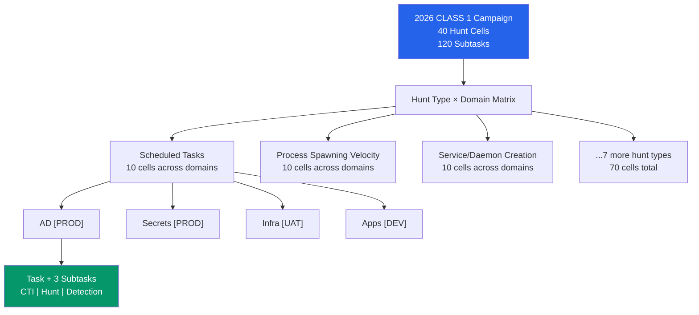
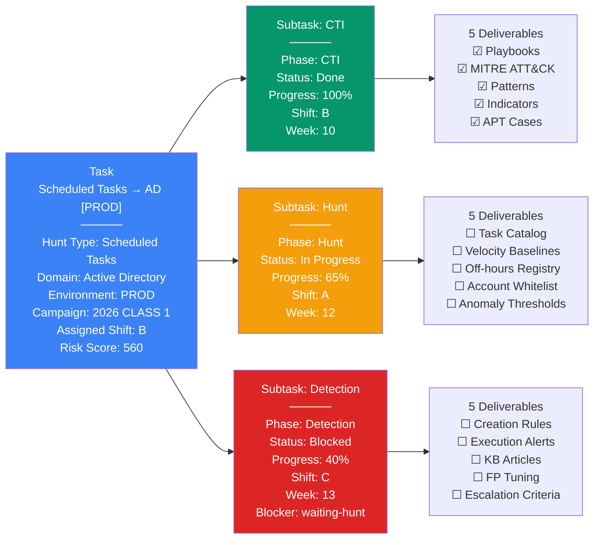
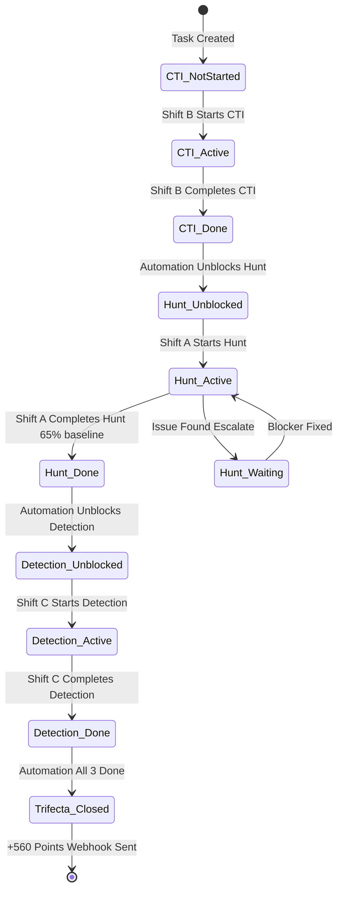
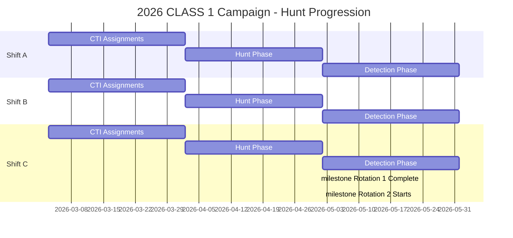
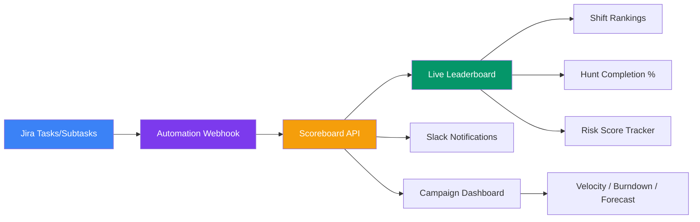

# Hunt Jeopardy: Jira Service Management Implementation Guide

> **Baseline hunt campaign management with CTI, Hunt, and Detection trifecta scoring**

---

## Table of Contents

1. [Overview](#overview)
2. [Architecture](#architecture)
3. [Implementation Approaches](#implementation-approaches)
   - [Approach 1: Tasks + Subtasks (Recommended)](#approach-1-tasks--subtasks-recommended)
   - [Approach 2: Timeline/Roadmap](#approach-2-timelineroadmap)
   - [Approach 3: Hybrid](#approach-3-hybrid)
4. [Custom Fields](#custom-fields)
5. [Labels Strategy](#labels-strategy)
6. [Board Configuration](#board-configuration)
7. [Automations](#automations)
8. [JQL Filters](#jql-filters)
9. [Deliverables Tracking](#deliverables-tracking)
10. [Integration & Scoring](#integration--scoring)
11. [Quick Start Guide](#quick-start-guide)

---

## Overview

Hunt Jeopardy is a 12-month baseline threat hunting campaign that:

- **Covers 10 baseline hunt types** across 4 domain categories
- **Produces 40 hunt cells** (10 hunt types × 4 domains per environment)
- **Enforces trifecta model**: CTI → Hunt → Detection (all 3 must complete for points)
- **Rotates shifts** across 3-month windows
- **Scores hunts** by risk (base 180 × environment multiplier × privilege multiplier)

**Example metrics:**
- Scheduled Tasks → AD [PROD]: 180 × 2 (prod) × 3 (domain admin) = **540 points**
- Data Staging → Secrets [UAT]: 180 × 1.5 (uat) × 2 (secrets) = **360 points**

---

## Architecture

### Campaign Structure



### Task Hierarchy



---

## Implementation Approaches

### Approach 1: Tasks + Subtasks (Recommended)

**Best for:** Daily shift operations, clear phase progression, real-time blocking

#### Workflow



**Pros:**
- ✅ Matches shift workflow (one task per hunt cell)
- ✅ Clear phase blocking (can't start Hunt until CTI done)
- ✅ Subtask inherits parent context
- ✅ Easy to track individual phase progress

**Cons:**
- ⚠️ 40 tasks + 120 subtasks to manage
- ⚠️ Limited long-term campaign view

---

### Approach 2: Timeline/Roadmap

**Best for:** Campaign planning, dependency visualization, capacity forecasting



**Pros:**
- ✅ Week-by-week campaign visibility
- ✅ Spot blockers and critical path
- ✅ Capacity planning
- ✅ Leadership reporting

**Cons:**
- ⚠️ Less detailed phase-by-phase tracking
- ⚠️ Requires careful date management

---

### Approach 3: Hybrid

**Best for:** Combined shift operations + campaign planning

- **Morning (9 AM):** Shift opens Kanban → which tasks are active?
- **Weekly (Monday):** Team reviews Timeline → are we hitting weeks? Any delays?
- **Monthly (1st):** Leadership views Dashboard → campaign health, risks, next actions

---

## Custom Fields

### Field Definitions

| Field Name | Type | Values/Example | Used In | Purpose |
|------------|------|---|---|---|
| **Hunt Type** | Dropdown | Scheduled Tasks, Process Spawning Velocity, Service/Daemon Creation, Package Manager Activity, Data Staging, Lateral Movement, Registry Persistence, Privilege Escalation, Network Share Enumeration, Cloud Resource Anomalies | Task + Subtask | Identify which baseline hunt |
| **Domain** | Dropdown | AD, Secrets/Identity, Infrastructure, Applications | Task + Subtask | Target system category |
| **Environment** | Dropdown | PROD, UAT, SIT, DEV | Task + Subtask | Deployment tier (affects risk score) |
| **Campaign** | Dropdown | 2026 CLASS 1, 2027 CLASS 2 | Task | Which campaign year/class |
| **Phase** | Dropdown | CTI, Hunt, Detection | Subtask | Which phase of trifecta |
| **Assigned Shift** | User Select | Shift A, Shift B, Shift C | Task + Subtask | Who owns this work |
| **ETA Week** | Number | 10, 12, 13 (week numbers) | Subtask | Target completion week |
| **Progress %** | Number | 0-100 | Subtask (Task = avg) | How far along |
| **Blocker Reason** | Dropdown | waiting-cti, waiting-hunt, queue, prod-priority, none | Subtask | Why is this blocked |
| **Risk Score** | Number | 180, 420, 560, 720 (calculated) | Task | Points awarded on trifecta |
| **Trifecta Status** | Checkbox | ☑ Complete, ☐ In Progress | Task | All 3 phases done? |
| **Depends On** | Link Issue | Parent task key | Subtask | Dependency relationship |

### Field Calculation: Risk Score

```
Base Score = 180
Environment Multiplier = { PROD: 2x, UAT: 1.5x, SIT: 1x, DEV: 0.5x }
Privilege Multiplier = { AD: 3x, Secrets: 2x, Infra: 2x, Apps: 1x }

Risk Score = Base × Env × Privilege

Examples:
  Scheduled Tasks → AD [PROD]      = 180 × 2 × 3 = 1,080 pts
  Data Staging → Secrets [UAT]     = 180 × 1.5 × 2 = 540 pts
  Network Share → Apps [DEV]       = 180 × 0.5 × 1 = 90 pts
```

---

## Labels Strategy

### Label Categories

| Category | Labels |
|----------|--------|
| **Campaign** | `campaign-2026-class1`, `campaign-2027-class2` |
| **Domain** | `domain-ad`, `domain-secrets`, `domain-infra`, `domain-apps` |
| **Environment** | `env-prod`, `env-uat`, `env-sit`, `env-dev` |
| **Phase** | `phase-cti`, `phase-hunt`, `phase-detection` |
| **Shift** | `shift-a`, `shift-b`, `shift-c` |
| **Status** | `blocked`, `trifecta-closed`, `in-progress` |
| **Blocker** | `blocker-cti`, `blocker-hunt`, `blocker-queue` |

### Label Usage in JQL

```jql
-- Find all PROD hunts in current campaign
labels in (campaign-2026-class1, env-prod)

-- Find blocked hunts (waiting CTI)
labels = blocked AND labels = blocker-cti

-- Shift A trifectas this month
labels in (shift-a, trifecta-closed) AND created >= -30d

-- Critical path (AD hunts in progress)
labels in (domain-ad, phase-hunt) AND status = "In Progress"
```

---

## Board Configuration

### Kanban Board: Swimlanes by Hunt Type

| Column | Status | Phase | Display | Trigger |
|--------|--------|-------|---------|---------|
| **CTI: Backlog** | To Do | CTI | Gray | Freshly created |
| **CTI: Active** | In Progress | CTI | Blue | Shift starts work |
| **Hunt: Blocked** | To Do | Hunt | Red + Blocker tag | Depends on CTI; CTI not done |
| **Hunt: Active** | In Progress | Hunt | Orange | CTI complete; Hunt in progress |
| **Detection: Blocked** | To Do | Detection | Red + Blocker tag | Depends on Hunt; Hunt not done |
| **Detection: Active** | In Progress | Detection | Orange | Hunt complete; Detection in progress |
| **Done** | Done | Any | Green | Status = Done |

---

## Automations

### Automation 1: Unblock Hunt When CTI Done

```yaml
Name: Unblock Hunt - CTI Complete
Trigger: Subtask with Phase = CTI AND Status changes to Done
Actions:
  - Find parent Task
  - Find sibling Subtask where Phase = Hunt
  - Set Hunt subtask Status = To Do
  - Remove label "blocked" from Hunt subtask
  - Clear "Blocker Reason" field
  - Send Slack notification: "@Shift-A Hunt phase unlocked for {Task}"
  - Add label "phase-hunt" for visibility
```

### Automation 2: Unblock Detection When Hunt Done

```yaml
Name: Unblock Detection - Hunt Complete
Trigger: Subtask with Phase = Hunt AND Status changes to Done
Actions:
  - Find sibling Subtask where Phase = Detection
  - Set Detection subtask Status = To Do
  - Remove label "blocked"
  - Clear "Blocker Reason"
  - Update parent Task Progress % = AVG(CTI%, Hunt%, Det%)
  - Send Slack: "@Shift-C Detection phase unlocked"
```

### Automation 3: Trifecta Closure & Scoring

```yaml
Name: Award Trifecta Points
Trigger: All 3 subtasks of parent Task are Status = Done
Actions:
  - Parent Task:
      - Add label "trifecta-closed"
      - Set "Trifecta Status" checkbox = ☑ Complete
  - Calculate Risk Score:
      - Base = 180
      - Env Multiplier = PROD(2x) | UAT(1.5x) | SIT(1x) | DEV(0.5x)
      - Privilege Multiplier = AD(3x) | Secrets(2x) | Infra(2x) | Apps(1x)
      - Risk Score = Base × Env × Privilege
  - Set parent Task Risk Score field
  - POST Webhook to Scoreboard:
      {
        "taskKey": "HUNT-42",
        "huntType": "Scheduled Tasks",
        "domain": "AD",
        "environment": "PROD",
        "shift": "B",
        "riskScore": 1080,
        "closedWeek": 10,
        "timestamp": "2026-03-23T14:30:00Z"
      }
  - Send Slack: "🏆 Shift B closed Scheduled Tasks! +1080 pts"
  - Create new Hunt Task for next rotation
```

### Automation 4: Daily Blocker Report

```yaml
Name: Morning Blocker Standup
Trigger: Daily at 09:00 AM
Conditions:
  - campaign = "2026 CLASS 1"
  - label = "blocked"
Actions:
  - Query blocked tasks by blocker-cti, blocker-hunt, blocker-queue
  - Send Slack summary report to team channel
```

### Automation 5: Progress Rollup

```yaml
Name: Update Task Progress - Average Subtasks
Trigger: Any Subtask Progress % field changes
Actions:
  - Find parent Task
  - Calculate avg: Task Progress % = (CTI % + Hunt % + Detection %) / 3
  - Update parent Task "Progress %" field
  - If Progress % >= 100: Slack "Task approaching completion: {Task}"
```

### Automation 6: Block Task on Blocker Set

```yaml
Name: Block Task - Prevent Progress
Trigger: "Blocker Reason" field is set AND Status = To Do
Actions:
  - Add label "blocked"
  - Add blocker-specific label: blocker-cti | blocker-hunt | blocker-queue
  - Set Due Date = (Related blocker's due date + 2 days)
  - Send Slack to Shift lead with blocker context
```

---

## JQL Filters

### Campaign Overview

```jql
-- All hunts in 2026 CLASS 1 campaign
project = HUNT AND label = campaign-2026-class1

-- PROD hunts only (high priority)
project = HUNT AND label = campaign-2026-class1 AND label = env-prod

-- Active (not yet trifecta-closed)
project = HUNT AND label = campaign-2026-class1
  AND (status != Done OR label != trifecta-closed)
  ORDER BY label ASC
```

### Phase Tracking

```jql
-- CTI phases not yet started
project = HUNT AND custom_field_phase = CTI AND status = "To Do"

-- Hunt phases blocked (waiting CTI)
project = HUNT AND custom_field_phase = Hunt
  AND label = blocker-cti AND status = "To Do"

-- Detection phases in progress
project = HUNT AND custom_field_phase = Detection AND status = "In Progress"
```

### Shift Leaderboard

```jql
-- Shift A trifectas this month
project = HUNT AND assignee = "Shift A"
  AND label = trifecta-closed AND created >= -30d
  ORDER BY created DESC

-- All trifectas ranked by points
project = HUNT AND label = trifecta-closed AND created >= -30d
  ORDER BY "Risk Score" DESC
```

### Blocker Analysis

```jql
-- All blocked hunts
project = HUNT AND label = blocked AND status = "To Do"
  ORDER BY "ETA Week" ASC

-- Critical blockers (PROD hunts stuck)
project = HUNT AND label = blocked
  AND label = env-prod AND "Blocker Reason" is not EMPTY
```

---

## Deliverables Tracking

### Method 1: Checklist in Description (Recommended)

```markdown
## Subtask: CTI Phase - Scheduled Tasks → AD [PROD]

### Deliverables
- [x] Threat actor playbooks using scheduled tasks
- [x] MITRE ATT&CK mapping (T1053)
- [x] Baseline task execution patterns by role
- [ ] Anomalous scheduling indicators
- [ ] Historical APT task abuse cases

### Status
- Completed: 3/5 (60%)
- Owner: Shift B | ETA: Week 10
```

### Method 2: Sub-Subtasks (Granular)

```
Task: Scheduled Tasks → AD [PROD]
  └─ Subtask: CTI Phase
      ├─ Sub: Threat actor playbooks
      ├─ Sub: MITRE ATT&CK mapping
      ├─ Sub: Baseline patterns
      ├─ Sub: Anomalous indicators
      └─ Sub: APT historical cases
  
  └─ Subtask: Hunt Phase
      ├─ Sub: Approved task catalog
      ├─ Sub: Velocity baselines
      ├─ Sub: Off-hours registry
      ├─ Sub: Account whitelist
      └─ Sub: Anomaly thresholds
  
  └─ Subtask: Detection Phase
      ├─ Sub: Creation/modification rules
      ├─ Sub: Execution alerts
      ├─ Sub: KB articles
      ├─ Sub: FP tuning
      └─ Sub: Escalation criteria
```

**Recommendation:** Use Method 1 (checklist) for simplicity; escalate to Method 2 if per-deliverable tracking is needed.

---

## Integration & Scoring

### Scoreboard Webhook Payload

```json
{
  "taskKey": "HUNT-42",
  "huntType": "Scheduled Tasks",
  "domain": "Active Directory",
  "environment": "PROD",
  "campaign": "2026 CLASS 1",
  "shift": "B",
  "riskScore": 1080,
  "deliverables": { "cti": 5, "hunt": 5, "detection": 5 },
  "closedWeek": 10,
  "timestamp": "2026-03-23T14:30:00Z",
  "jiraLink": "https://jira.example.com/browse/HUNT-42"
}
```

### Metrics Pipeline



---

## Quick Start Guide

### Phase 1: Setup (Day 1)

1. **Create 9 Custom Fields** in JSM (30 min)
2. **Configure Kanban Board** — 7 columns, swimlanes by hunt type (30 min)
3. **Bulk import 40 Tasks** via CSV (1 hour)
4. **Auto-create 120 Subtasks** via automation (15 min)

### Phase 2: Operationalize (Days 2-3)

1. **Configure 6 Automations** — unblock, score, report, rollup (30 min)
2. **Create JQL Filters** — overview, phase, leaderboard, blockers (30 min)
3. **Deploy Webhook** — POST to scoreboard API, test trifecta closure (1 hour)
4. **First Standup** — walk shifts through board and scoring model (1 hour)

### CSV Template for Bulk Import

```csv
Summary,Hunt Type,Domain,Environment,Campaign,Phase,Assigned Shift,ETA Week,Labels
CTI: Scheduled Tasks → AD [PROD],Scheduled Tasks,Active Directory,PROD,2026 CLASS 1,CTI,Shift B,10,campaign-2026-class1|phase-cti|domain-ad|env-prod|shift-b
Hunt: Scheduled Tasks → AD [PROD],Scheduled Tasks,Active Directory,PROD,2026 CLASS 1,Hunt,Shift A,12,campaign-2026-class1|phase-hunt|domain-ad|env-prod|shift-a|blocker-cti|blocked
Detection: Scheduled Tasks → AD [PROD],Scheduled Tasks,Active Directory,PROD,2026 CLASS 1,Detection,Shift C,13,campaign-2026-class1|phase-detection|domain-ad|env-prod|shift-c|blocker-hunt|blocked
```

### Shift Onboarding Checklist

```
☐ Account created in Jira
☐ Added to Shift group (Shift A/B/C)
☐ Shown Kanban board (swimlanes + columns)
☐ Understands phase ownership
☐ Can update Progress % and mark deliverables
☐ Understands blocking model (CTI → Hunt → Detection)
☐ Understands Risk Score calculation
☐ Shown leaderboard/scoreboard
☐ Understands Trifecta model (all 3 must complete for points)
☐ Slack notifications configured
☐ First task assigned (Week 1 CTI)
```

---

## Summary: Recommended Implementation

| Dimension | Recommendation | Rationale |
|-----------|-----------------|-----------|
| **Structure** | Tasks + Subtasks | Matches shift workflow, clear blocking |
| **Board** | Kanban with swimlanes | Visual, phase-based, real-time |
| **Custom Fields** | 9 essential fields | Minimal but sufficient for automation |
| **Labels** | 20 hierarchical labels | Enables complex JQL filtering |
| **Automations** | 6 core automations | Blocks work, unblocks work, scores, reports |
| **Integrations** | Webhook + Slack | Live scoreboard, daily standup |
| **Reporting** | Timeline view + Dashboard | Campaign visibility, leadership reporting |
| **Timeline** | Parallel implementation | Kanban Day 1, Roadmap Week 2, Integration Week 3 |

---

## Appendix: Baseline Hunt Types Reference

| # | Hunt Type | Focus | Key Risks |
|---|-----------|-------|-----------|
| 1 | **Scheduled Tasks** | Task execution, scheduling, off-hours activity | Persistence, scheduled code execution, privilege escalation |
| 2 | **Process Spawning Velocity** | Process creation rate, spawning patterns, anomalies | Malware execution chains, living-off-the-land, credential theft |
| 3 | **Service/Daemon Creation** | Service installation, binary paths, service accounts | Persistence, backdoors, credential theft |
| 4 | **Package Manager Activity** | Repository access, package installation, supply chain | Supply chain compromise, malware installation, lateral movement |
| 5 | **Data Staging** | Large file movement, aggregation, unusual destinations | Exfiltration prep, data theft, lateral movement |
| 6 | **Lateral Movement** | Inter-system communication, admin hop boxes, credential reuse | Privilege escalation, domain admin compromise, worm spread |
| 7 | **Registry Persistence** | Registry modifications, persistence keys, rootkits | Persistence, evasion, privilege escalation |
| 8 | **Privilege Escalation** | Token impersonation, UAC bypasses, kernel exploits | System account compromise, domain admin elevation |
| 9 | **Network Share Enumeration** | Share discovery, admin share access, hidden shares | Reconnaissance, data discovery, lateral movement |
| 10 | **Cloud Resource Anomalies** | API calls, resource creation, cross-account access | Cloud lateral movement, privilege escalation, resource hoarding |

---

**Document Version:** 1.0  
**Last Updated:** March 2026  
**Author:** James (nobytes)  
**Status:** Production Ready
